[hello-rust](https://github.com/Vellinhellin/hello-rust)
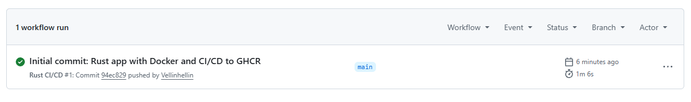
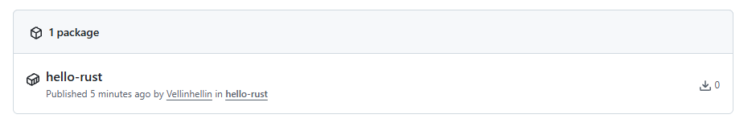
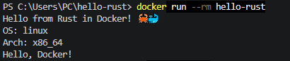
---

[hello-go1](https://github.com/Vellinhellin/hello-go)
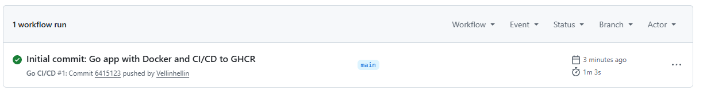
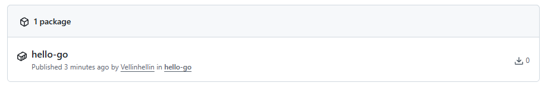
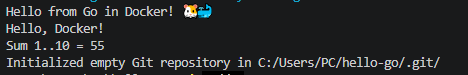
---

[hello-go2](https://github.com/Vellinhellin/hello-go)
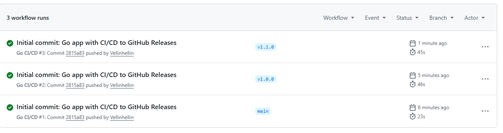
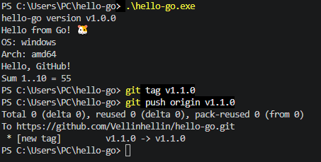\
---

[hello-python](https://github.com/Vellinhellin/hello-python)
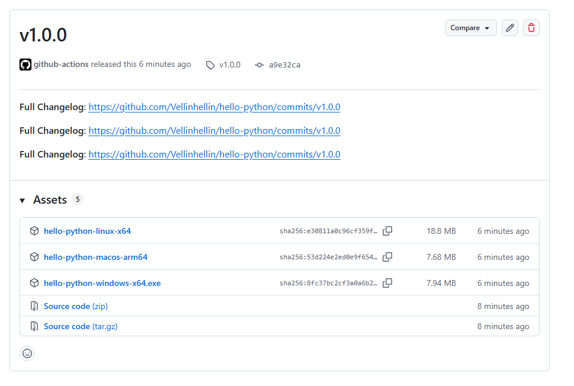
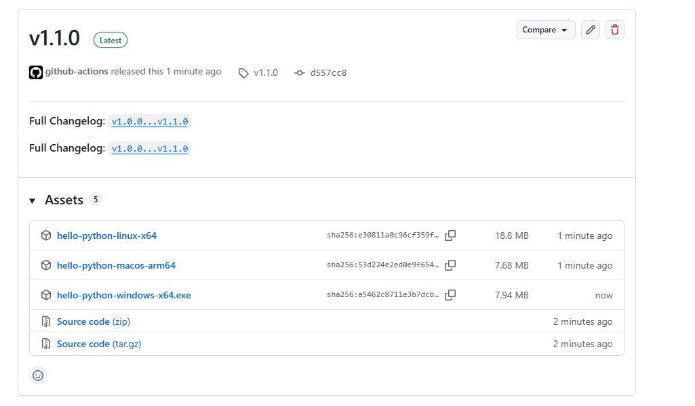
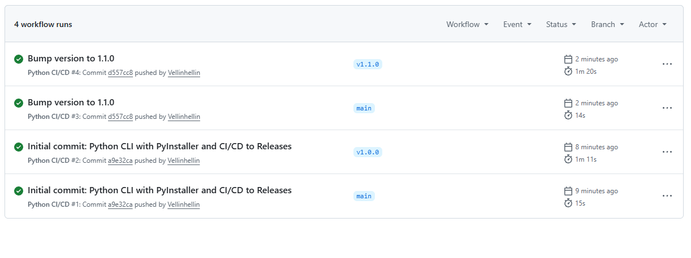
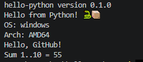
---

[hello-dotnet](https://github.com/Vellinhellin/hello-dotnet)
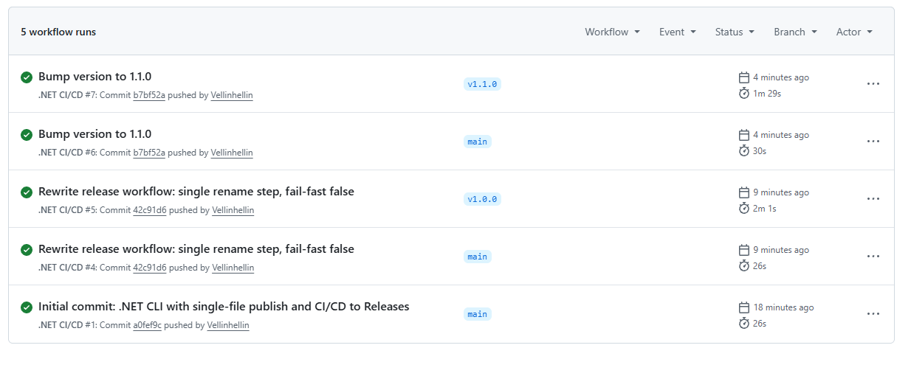
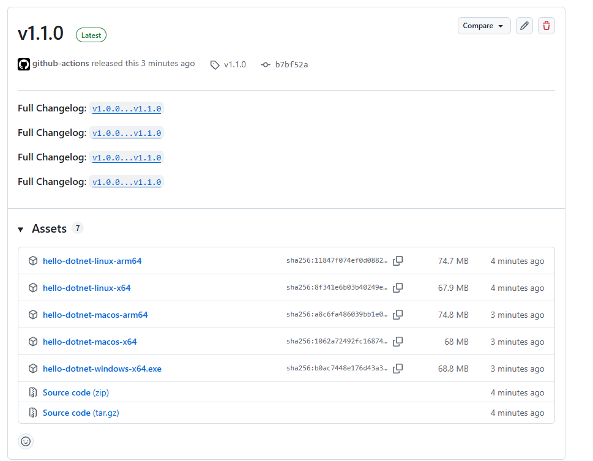
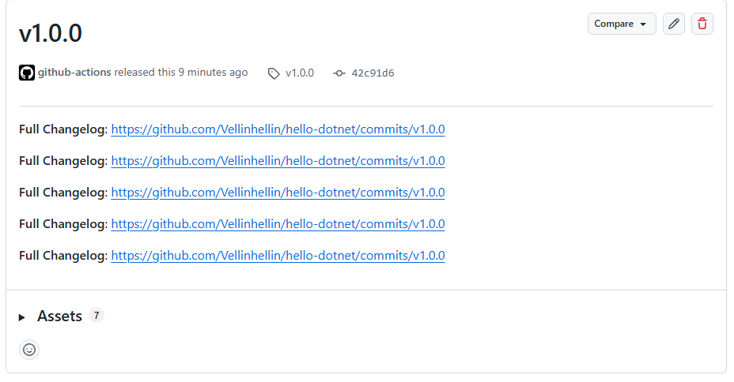
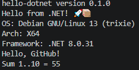
---
